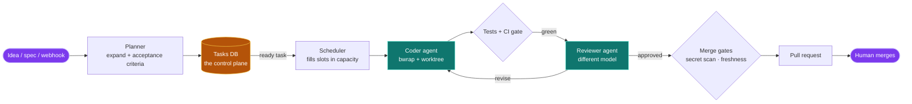
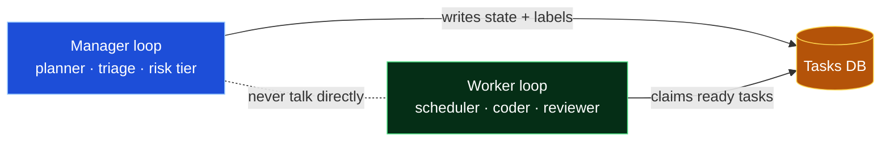
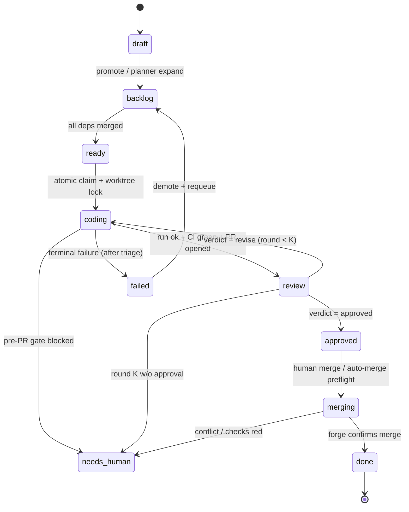
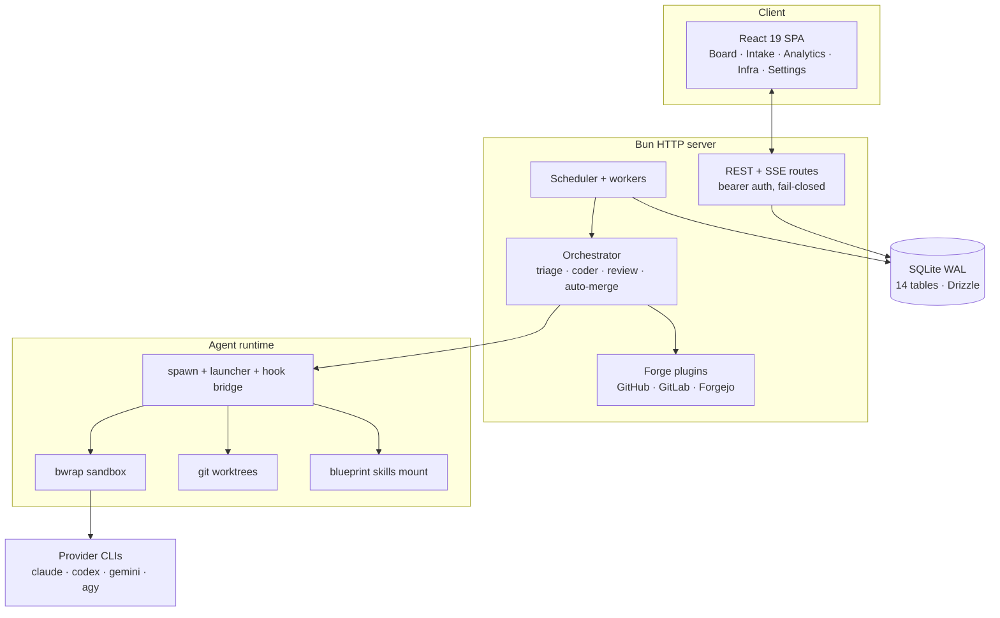

<div align="center">

# 🌙 Nightshift

### Autonomous software factory — it ships code while you sleep.

Plan in → tasks → kanban → coding agents in isolated git worktrees → pull request → cross-model AI review ping-pong → merge.

[](https://bun.sh)
[](https://www.typescriptlang.org/)
[](https://orm.drizzle.team/)
[](https://react.dev/)
[](#testing)
[](https://github.com/containers/bubblewrap)

</div>

---

## What is Nightshift?

Nightshift is a self-hosted **loop-engineering** platform: you describe work as tasks, and a fleet of AI coding agents (Claude Code, Codex, Gemini, and API providers) picks them up unattended, implements each one in an **isolated git worktree**, runs the tests, has a **different model adversarially review the diff**, and opens a pull request — all gated so a human owns every merge.

> You don't prompt agents. You design loops, and the loops do the work. Nightshift *is* that loop, in code.

The engineering is in the **boundaries**, not the agents: every task has a risk tier, every agent runs in a sandbox with no host filesystem visibility, the model that writes code is never the model that approves it, and nothing merges without passing CI, a secret scan, and a branch-freshness gate.

### Who it's for

- **Solo devs & small teams** who want a backlog that drains itself overnight.
- **Platform engineers** building an internal "AFK agent" service with audit trails.
- **Anyone** who wants Claude Code / Codex to run on a schedule against real tickets, safely.

---

## Features

| Area | What you get |
|------|--------------|
| 🧠 **Multi-provider agents** | Claude Code, Codex, Gemini, Antigravity (`agy`), OpenCode, OpenRouter, local Ollama, and a CMA fallback — switchable per task |
| 🗂️ **Kanban control plane** | Tasks flow `draft → backlog → ready → coding → review → approved → merging → done` with an atomic claim and dependency-aware readiness |
| 🔒 **Sandboxed execution** | Every agent runs inside a `bwrap` (bubblewrap) namespace — worktree rw, no host `/home`, credentials read-only; fail-closed off Linux |
| 🌳 **Isolated worktrees** | One task = one branch = one worktree = one disposable lane; a failure never poisons another task |
| ⚖️ **Cross-model review ping-pong** | A reviewer of a *different* model judges each diff; rounds repeat until `approved` or escalate to a human — with a **tournament + tiebreaker** mode |
| 🚦 **Merge gates** | CI gate, secret scan, branch-freshness check, and trusted-check-app verification before any PR can merge |
| 🔁 **Schedulers & triggers** | Cron-style routines and webhook triggers spawn work; the scheduler fills slots within provider capacity caps |
| 📋 **Blueprint workflow skills** | Spawned coders are handed [owainlewis/blueprint](https://github.com/owainlewis/blueprint) skills (`implement → tdd → debug → refactor → review`) so they follow a disciplined process instead of improvising |
| 🔌 **Forge-agnostic** | GitHub (first-class), GitLab, and Forgejo plugins for push, PR, and merge |
| 📊 **Observability** | Live SSE event stream, per-run transcripts, analytics, an experiment ledger, and an agent-memory store |
| 🛡️ **Fail-closed security** | Bearer-token auth on every endpoint, nftables egress allowlist for untrusted repos, secret masking in the settings registry |
| 🎛️ **Runtime-tunable config** | 58 settings knobs editable live (global / project / routine scope) without a restart |

---

## Architecture

### The pipeline



### Loop-engineering control plane

The loops never talk to each other — they coordinate **only** through the tasks database. One writes state; the other queries it.



### Task state machine



### System components



---

## Project structure

```
nightshift/
├── src/
│   ├── server/         HTTP server, routes, SSE, bootstrap (main.ts)
│   ├── scheduler/      slot-filling loop + worker leases
│   ├── orchestrator/   triage · coder · review · auto-merge · evidence routing
│   ├── planner/        idea → tasks expansion + bootstrap
│   ├── review/         review engine · tournament · tiebreaker · judges · risk tier
│   ├── forge/          GitHub / GitLab / Forgejo · push · PR · merge · secret scan
│   ├── runs/           spawn · launcher · hook bridge · watchdog · reap · transcript · skills
│   ├── worktree/       isolated git worktree lifecycle
│   ├── sandbox/        bwrap profile builder + invariant checks
│   ├── providers/      capacity caps · failback · CLI drivers · auth health
│   ├── tasks/          state transitions · dependencies · draft lane
│   ├── gate/           CI / merge gate
│   ├── triggers/       webhooks + cron routines
│   ├── egress/         nftables egress allowlist control
│   ├── config/         config loader + runtime-tunable registry (58 knobs)
│   ├── db/             Drizzle schema (14 tables) + migrations
│   ├── events/         append-only event log
│   ├── memory/         agent-memory store
│   ├── preview/ experiment/ analytics/ notify/ container/ maintenance/ verify/ thread/
├── web/                React 19 kanban UI (Board, Intake, Analytics, Infra, Settings…)
├── vendor/
│   ├── sandcastle/     embedded agent-sandbox orchestration library
│   └── blueprint-skills/  vendored workflow skills mounted into coder worktrees
├── ops/                prep-debian.sh · deploy.sh · egress-*.sh · nightshift.service
├── docs/               BLUEPRINT spec · state machines · schema · threat model
└── drizzle/            generated SQL migrations
```

---

## Tech stack & dependencies

| Layer | Choice |
|-------|--------|
| **Runtime / package manager / test runner** | [Bun](https://bun.sh) ≥ 1.3 (replaces Node + npm) |
| **Language** | TypeScript (strict, `noUncheckedIndexedAccess`) |
| **Database** | SQLite in WAL mode via [Drizzle ORM](https://orm.drizzle.team/) + drizzle-kit migrations |
| **UI** | React 19 + `@dnd-kit` drag-and-drop kanban + `@xterm` live terminals |
| **Sandbox** | [bubblewrap](https://github.com/containers/bubblewrap) (`bwrap`) — Linux namespaces |
| **Agent CLIs** | `claude` (Claude Code), `codex`, `gemini`, `agy` (Antigravity) — installed on demand |
| **Forge** | GitHub / GitLab / Forgejo REST APIs |

---

## Installation

> Quick start below. The exhaustive reference — every env var, the macOS `PATH` gotcha, nginx, egress — lives in **[INSTALL.md](INSTALL.md)**.

### Prerequisites

| Tool | Version | Notes |
|------|---------|-------|
| [Bun](https://bun.sh) | ≥ 1.3 | The only hard requirement to run the server |
| Git | ≥ 2.38 | Worktrees + forge features |
| `claude` CLI | latest | `npm i -g @anthropic-ai/claude-code` — default coder |
| `codex` CLI | latest | `npm i -g @openai/codex` — default reviewer |
| `bwrap` | any | **Linux only** — `apt install bubblewrap` |

### 🍎 macOS (development)

The `bwrap` sandbox is Linux-only, so macOS uses attended-dev escape hatches.

```sh
# 1. Clone + install
git clone https://github.com/your-org/nightshift.git
cd nightshift
bun install
bun run db:migrate          # creates data/nightshift.db (also auto-runs on boot)

# 2. Create .env.local
cat > .env.local <<'EOF'
NIGHTSHIFT_API_TOKEN=dev-token-change-me
NIGHTSHIFT_ALLOW_UNSANDBOXED_ONESHOTS=1   # reviewer CLI without bwrap
NIGHTSHIFT_ALLOW_UNSANDBOXED_CODER=1      # coder CLI without bwrap
EOF

# 3. Start — pass a PATH that includes your agent CLIs
PATH="$HOME/.local/bin:$HOME/.bun/bin:$PATH" bun run dev
```

Then open **http://localhost:3000** and smoke-test:

```sh
curl http://localhost:3000/healthz                                   # {"ok":true}
curl -H "Authorization: Bearer dev-token-change-me" \
     http://localhost:3000/routes                                    # route listing
```

> **PATH gotcha:** Nightshift spawns `claude`/`codex` with the *server's* PATH, not your shell profile. Start it from a terminal where `which claude` and `which codex` resolve.

### 🐧 Linux (production)

Real sandboxing only runs here. The `ops/` scripts are idempotent.

```sh
# On the server, as a sudo user:
git clone https://github.com/your-org/nightshift.git /opt/nightshift
cd /opt/nightshift

# 1. Prepare the host: OS packages + Bun + claude/codex CLIs + bwrap + nft
bash ops/prep-debian.sh

# 2. Deploy: service user, DB migrate, systemd unit, health-check
sudo \
  NIGHTSHIFT_API_TOKEN="$(openssl rand -hex 32)" \
  GITHUB_TOKEN="ghp_yourtoken" \
  bash ops/deploy.sh
```

`ops/deploy.sh` creates the `nightshift` user, installs Bun, runs migrations, writes secrets to `/etc/nightshift/env` (mode 640), installs `nightshift.service`, and health-checks `/healthz`.

```sh
systemctl status nightshift.service
journalctl -u nightshift.service -f      # live logs
git pull --ff-only && sudo bash ops/deploy.sh   # update
```

**Hardening for untrusted repos** — turn on the nftables egress allowlist:

```sh
SERVICE_UID=$(id -u nightshift)
sudo NIGHTSHIFT_EGRESS_UID=$SERVICE_UID bash ops/egress-apply.sh
```

…then set `sandbox.unattendedUntrustedRepos: true` and `sandbox.egressAllowlist` in config. Full details (nginx SSE proxy, teardown, etc.) in **[INSTALL.md](INSTALL.md)** and **[docs/LINUX-DEPLOY.md](docs/LINUX-DEPLOY.md)**.

> 🤖 For an **agent-driven** install with verify gates, hand **[docs/LINUX-SETUP-AGENT.md](docs/LINUX-SETUP-AGENT.md)** to a Claude Code CLI running on the host.

---

## Usage

1. **Open the UI** at your host (`http://localhost:3000` in dev).
2. **Intake** — drop an idea, spec, or rough capture into the Intake view. The planner expands it into tasks with acceptance criteria.
3. **Board** — watch tasks move across the kanban: `backlog → ready → coding → review → approved → done`. Add tasks inline, delete, or switch projects from the dropdown.
4. **Let it run** — the scheduler claims `ready` tasks within your concurrency cap, spawns a sandboxed coder in a fresh worktree, runs tests, and triggers cross-model review.
5. **Review PRs** — the system opens pull requests and stops. **You own every merge.** Approve in the forge (or enable auto-merge once you trust it).
6. **Observe** — per-run transcripts, the live event stream, analytics, and the experiment ledger show exactly what each agent did and decided.

### Configuration

```sh
cp nightshift.config.example.json nightshift.config.json
```

Key knobs (full reference in the example file and the registry):

```jsonc
{
  "providers": { "defaultCoder": "claude-code", "defaultReviewer": "codex" },
  "concurrency": { "maxParallelSlots": 1 },        // raise on beefy hosts
  "review": { "maxRounds": 3, "autoMergeEnabled": false },
  "coder": { "skillsMount": ["implement","tdd","debug","refactor","review"] },
  "sandbox": { "unattendedUntrustedRepos": false }
}
```

Most knobs are also editable **live** at runtime (global / project / routine scope) from the Settings view — no restart.

---

## Testing

```sh
bun run test        # full suite — NOTE: bare `bun test` hangs (no file filter)
bun run typecheck   # tsc --noEmit
```

The suite runs **1167 tests** across 85 files on every change.

---

## Documentation

| Doc | What it covers |
|-----|----------------|
| [INSTALL.md](INSTALL.md) | Complete install, config, env vars, troubleshooting |
| [docs/BLUEPRINT.md](docs/BLUEPRINT.md) | The binding spec (§3.12 = hardening amendments) |
| [docs/SPEC-STATE-MACHINES.md](docs/SPEC-STATE-MACHINES.md) | Task / run / review-round state machines |
| [docs/SPEC-SCHEMA.md](docs/SPEC-SCHEMA.md) | Database schema |
| [docs/THREAT-MODEL.md](docs/THREAT-MODEL.md) | Security model & sandbox invariants |
| [docs/LINUX-DEPLOY.md](docs/LINUX-DEPLOY.md) | Production deployment runbook |
| [REUSE.md](REUSE.md) | Code reused from sibling projects |

---

## Security model

- **Fail-closed auth** — every protected route returns `503` until `NIGHTSHIFT_API_TOKEN` is set; bearer required thereafter.
- **Sandbox-or-refuse** — the coder spawns inside `bwrap` or not at all on Linux (escape hatch is attended-dev macOS only).
- **Maker ≠ checker** — the model that writes a diff never approves it.
- **Human-owned merges** — Nightshift opens PRs; it never merges without explicit approval (or a trusted auto-merge preflight you opt into).
- **Egress allowlist** — untrusted-repo runs are confined to an nftables destination allowlist.

---

<div align="center">

**Nightshift** — the boring, boundaried way to let agents ship code overnight.

</div>
